# 🌾 PMFBY District-Level Crop Insurance Performance Analysis Using Python (2018–2022)


## 📌 Project Overview

This project performs a **district-level analysis of Pradhan Mantri Fasal Bima Yojana (PMFBY)** data for **2018–2022** using Python.

The analysis focuses on farmer participation, seasonal patterns, insurance coverage, demographic participation, district performance and financial contributions. The project applies **data cleaning, feature engineering, descriptive statistics and exploratory data analysis (EDA)** to convert the raw PMFBY dataset into meaningful insights.

---

## 🎯 Objectives

### 1. Participation & Seasonal Analysis
- Analyse PMFBY participation across states and districts from 2018–2022.
- Compare **Kharif and Rabi** participation.

### 2. Farmer Participation Analysis
- Analyse **Loanee vs Non-Loanee** participation.
- Examine **gender-wise** participation.
- Analyse participation by **Small, Marginal and Other** farmer categories.

### 3. Insurance & Financial Analysis
- Analyse **Area Insured, Insurance Units and Sum Insured**.
- Examine **Gross Premium, Farmer Share, GOI Share and State Share**.
- Compare **Total Premium Contribution** and **Total Government Share**.

### 4. District Performance Assessment
- Identify districts with high **Insurance Value per Application**.
- Compare district-level participation and insurance performance.

---

## 📊 Dataset Information

| Attribute | Details |
|---|---|
| Dataset | PMFBY District-Level Crop Insurance Data |
| Period | 2018–2022 |
| Records | 6,161 |
| Variables | 28 original variables |
| Geography | State and District |
| Seasons | Kharif and Rabi |
| Domain | Agriculture / Crop Insurance |

The dataset contains participation, geographic, insurance, demographic and financial variables. The notebook confirms **6,161 observations and 28 original columns**.

---

## 🛠️ Tools & Technologies

- **Python**
- **Pandas**
- **NumPy**
- **Matplotlib**
- **Seaborn**
- **Google Colab**

---

## 🔄 Project Workflow

```text
Raw Dataset
     ↓
Data Inspection
     ↓
Data Cleaning
     ↓
Missing Value Treatment
     ↓
Data Transformation
     ↓
Feature Engineering
     ↓
Statistical Analysis
     ↓
Univariate Analysis
     ↓
Bivariate Analysis
     ↓
Multivariate Analysis
     ↓
Insights & Interpretation
     ↓
Key Findings
     ↓
Analytical Framework
     ↓
Recommendations & Conclusion
```

---

## 🧹 Data Cleaning

The project performs:

- Dataset structure and data-type inspection
- Missing-value analysis
- Duplicate and consistency checks
- Negative-value validation for numerical variables
- District-name standardisation
- Appropriate missing-value treatment
- Data-type conversion where required
- Final null-value validation

After transformation, the final EDA confirms that the main derived variables such as `Total_Applications` and `Sum_Insured` contain no missing values.

---

## ⚙️ Feature Engineering

### Total Applications

```python
df["Total_Applications"] = (
    df["Loanee"] + df["Non_Loanee"]
)
```

### Total Government Share

```python
df["Total_Government_Share"] = (
    df["GOI_Share"] + df["State_Share"]
)
```

### Total Premium Contribution

```python
df["Total_Premium_Contribution"] = (
    df["Farmer_Share"]
    + df["GOI_Share"]
    + df["State_Share"]
)
```

### Insurance Value per Application

```python
df["Insurance_Per_Application"] = (
    df["Sum_Insured"] /
    df["Total_Applications"]
)
```

These derived variables are used for participation, financial and district-performance analysis.

---

# 📈 Statistical Analysis

The project uses:

### Central Tendency
- Mean
- Median
- Mode

### Dispersion
- Variance
- Standard Deviation

### Distribution
- Skewness
- Kurtosis

The analysis shows that major numerical variables have considerable variation and positive skewness, indicating that a smaller number of high-value observations influence the overall distribution.

---

# 📊 Exploratory Data Analysis

## 1. Univariate Analysis

### Loanee Farmer Distribution

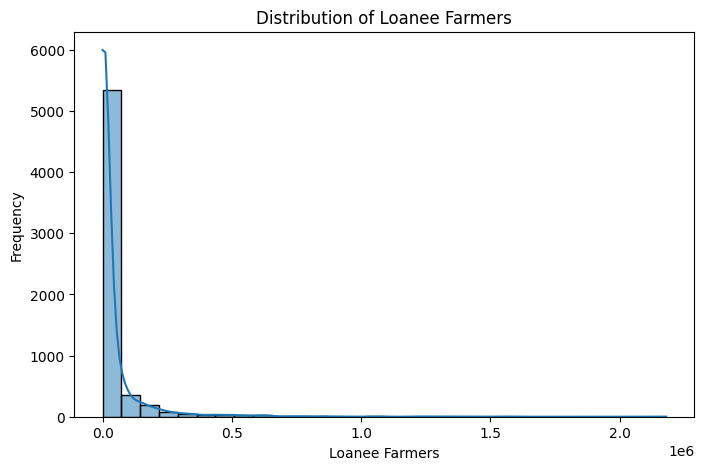

**Insight:** Loanee participation is positively/right-skewed. Most observations are relatively low, while a smaller number of observations have exceptionally high participation.

### Non-Loanee Farmer Distribution

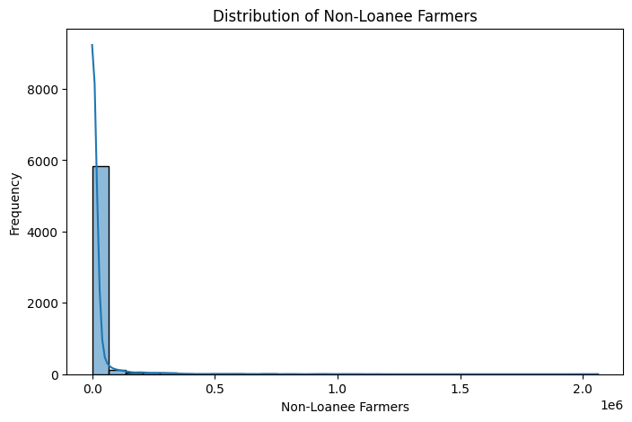

**Insight:** Non-Loanee participation is also unevenly distributed, with a smaller number of observations showing substantially higher participation.

### Insurance Unit Distribution

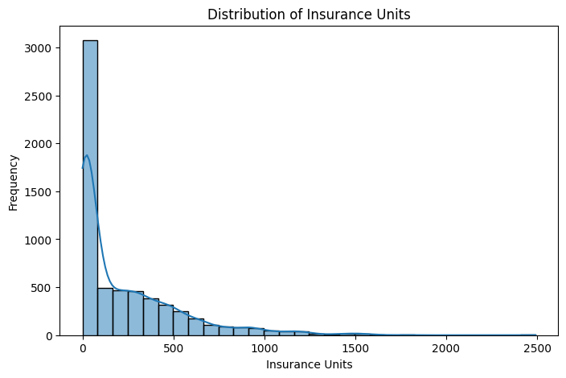

**Insight:** Insurance Unit values are unevenly distributed, with most observations concentrated at lower levels and a smaller number of observations recording very high values.

---

# 📊 2. Bivariate Analysis

## Year-wise Trend of Total Applications

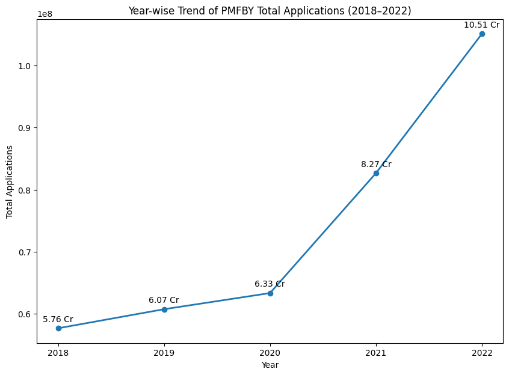

**Insight:** PMFBY Total Applications show a strong overall upward trend from 2018 to 2022, with the highest participation recorded in 2022.

## Season-wise Total Applications

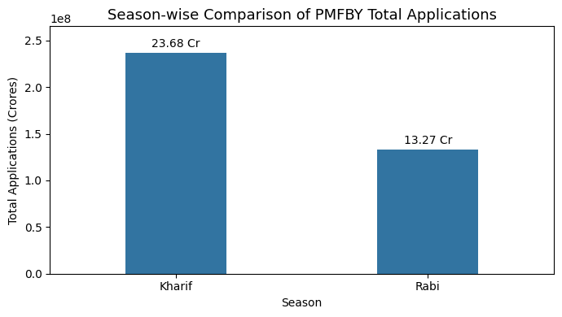

**Insight:** Kharif participation is consistently higher than Rabi, indicating a clear seasonal difference in PMFBY participation.

## Loanee vs Non-Loanee Participation

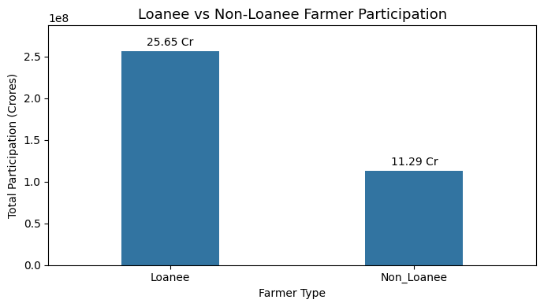

**Insight:** Loanee farmers have substantially higher participation than Non-Loanee farmers, showing a clear participation gap between the two groups.

## Area Insured vs Sum Insured

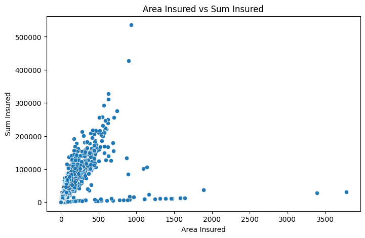

**Insight:** Larger insured areas generally correspond to higher Sum Insured, although considerable variation exists across individual observations.

---

# 📊 3. Multivariate Analysis

## Year-wise and Season-wise Total Applications

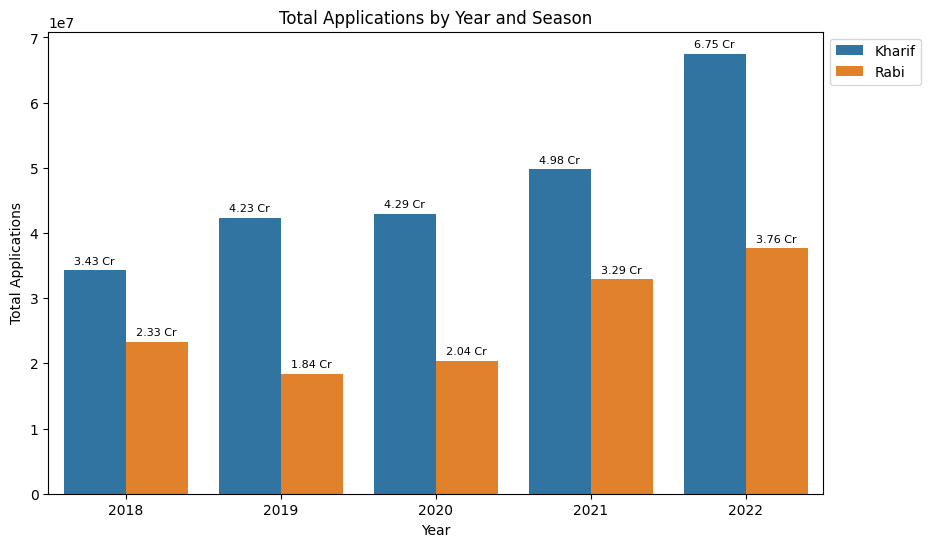

**Insight:** Kharif applications increased from **3.43 Cr in 2018 to 6.75 Cr in 2022**, while Rabi applications increased from **2.33 Cr to 3.76 Cr**. Kharif remained the dominant season throughout the period.

## State-wise Total Applications Across Years

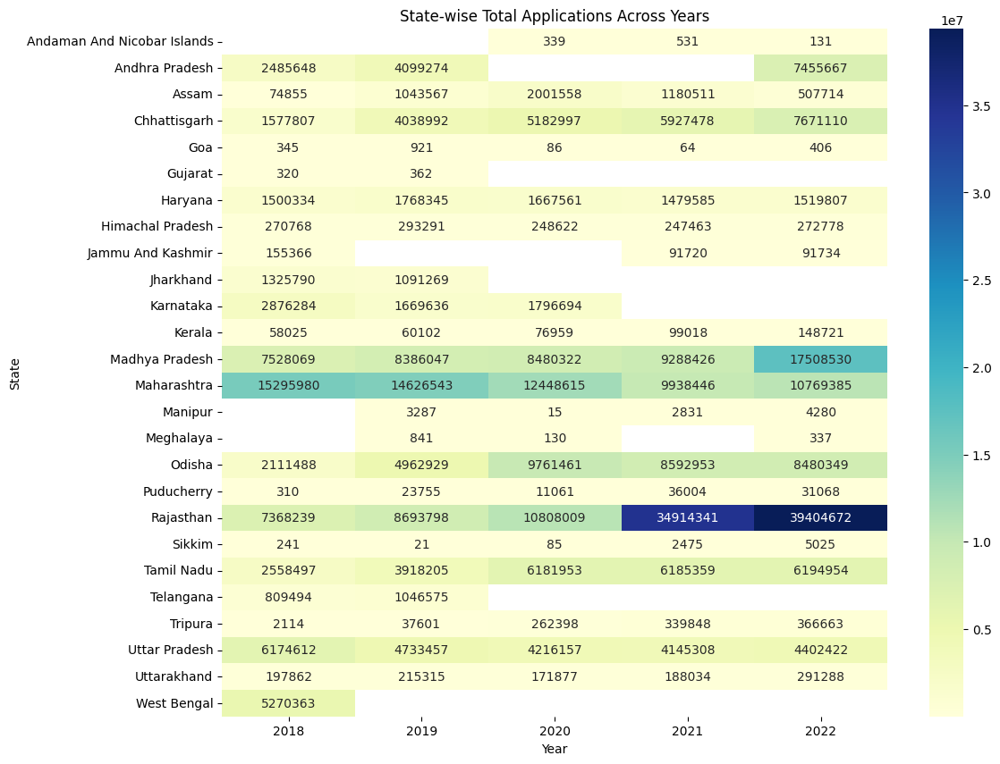

**Insight:** The heatmap shows substantial variation in PMFBY participation across states and years. Participation patterns are not uniform across regions, highlighting differences in district and state-level scheme participation.

## Top 10 Districts by Insurance Value per Application

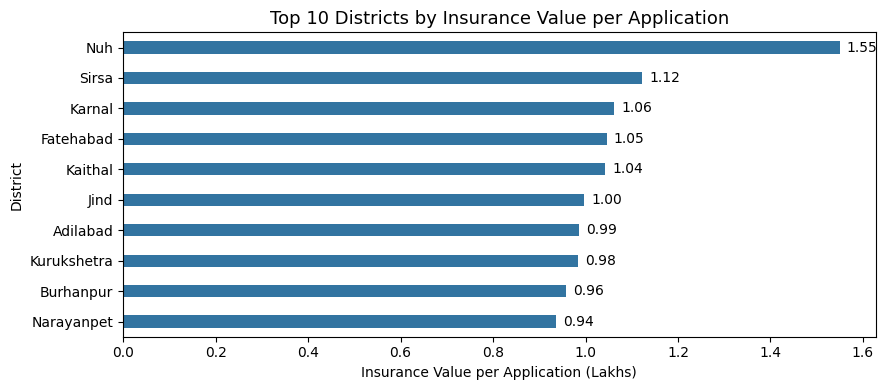

**Insight:** **Nuh recorded the highest Insurance Value per Application at 1.55 Lakhs**, followed by **Sirsa at 1.12 Lakhs** and **Karnal at 1.06 Lakhs**. This shows that higher application volume does not necessarily mean a higher insurance value per application.

## Overall Gender-wise Farmer Participation

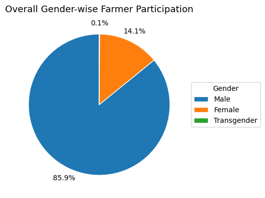

**Insight:** Male farmers account for **85.9%** of overall participation, while Female farmers account for **14.1%** and Transgender farmers account for **0.1%**, showing a large gender participation gap.

## Year-wise Total Premium and Government Contribution

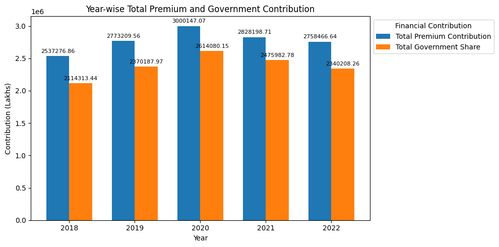

**Insight:** Total Premium Contribution remained higher than Total Government Share across the analyzed years. Both financial measures increased up to around **2020** and declined afterward.

## Farmer-Type Participation Across Years

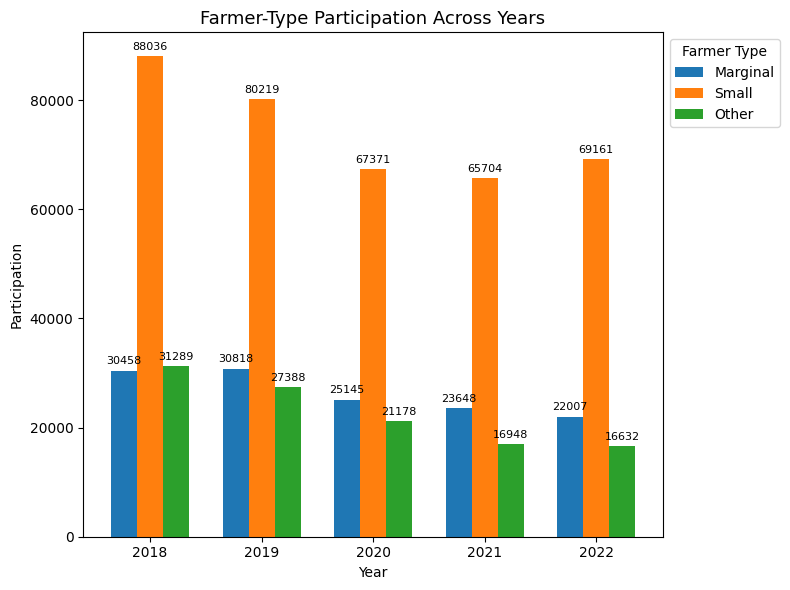

**Insight:** Small farmers recorded the highest participation across the analyzed years, followed by Marginal and Other farmers. Small farmer participation declined from the earlier years and showed a partial recovery in 2022.

---

# 🔍 Key Findings

- PMFBY participation shows a strong overall increase from **2018 to 2022**.
- **Kharif** remained the dominant season throughout the study period.
- **Loanee** participation is substantially higher than Non-Loanee participation.
- PMFBY participation varies considerably across states and districts.
- Area Insured and Sum Insured show a generally positive relationship.
- **Male farmers represent 85.9%** of overall participation.
- **Small farmers** form the largest participating farmer category.
- **Nuh** recorded the highest Insurance Value per Application among the selected top 10 districts.
- Total Premium Contribution remained higher than Total Government Share.
- Major numerical variables show considerable variation, positive skewness and heavy-tailed distributions.

---

# 🧠 Analytical Framework

## 14.1 Descriptive Analysis — What Happened?

The analysis summarizes PMFBY participation, seasonal trends, insurance coverage, farmer demographics, district performance and financial contributions using descriptive statistics and visualizations.

## 14.2 Diagnostic Analysis — Why Did It Happen?

The analysis shows differences across seasons, regions and farmer groups. Loanee, gender and farmer-type participation vary substantially, while district-level Insurance Value per Application also differs considerably. High skewness and kurtosis indicate strong variation and extreme observations.

These are observed patterns and are not confirmed causal relationships without additional external data.

## 14.3 Predictive Analysis — What May Happen?

Historical trends can be used to estimate future PMFBY applications, seasonal participation, state and district participation, insurance coverage and financial contributions. Actual prediction requires a suitable predictive model and validation.

## 14.4 Prescriptive Analysis — What Should Be Done?

The findings suggest monitoring low-participation regions and farmer groups, strengthening Non-Loanee and Female farmer outreach, studying high-performing districts and monitoring seasonal, farmer-type and financial trends. Data quality and extreme values should be validated before advanced modelling.

---

# 💡 Recommendations

### Improve Data Quality
Validate missing values, duplicates, inconsistent names and extreme observations before advanced modelling.

### Strengthen Non-Loanee Participation
Further investigate the participation gap between Loanee and Non-Loanee farmers.

### Improve Female Participation
The gender distribution indicates an opportunity to study and address the large Male–Female participation gap.

### Monitor Seasonal Patterns
Track Kharif and Rabi separately because participation levels differ significantly.

### Investigate District Performance
Study districts with high Insurance Value per Application to understand factors associated with stronger insurance coverage.

### Monitor Farmer-Type Trends
Track changes in Small, Marginal and Other farmer participation over time.

### Monitor Financial Contributions
Regularly analyse Farmer Share, Government Share and Total Premium Contribution.

---

# 🚀 Future Scope

- Automate the Python analysis workflow when new PMFBY data becomes available.
- Build predictive models for future farmer participation.
- Forecast seasonal and district-level participation.
- Add crop-level analysis.
- Integrate rainfall and weather information.
- Analyse crop-wise insurance performance.
- Study relationships between crop type, insured area, premium and claims.

---

# 📁 Project Structure

```text
PMFBY-District-Crop-Insurance-Analysis/
│
├── agri_db.csv
├── PMFBY_Analysis.ipynb
├── PMFBY_Project_Documentation.docx
├── README.md
│
└── images/
    ├── loanee_distribution.png
    ├── non_loanee_distribution.png
    ├── insurance_unit_distribution.png
    ├── yearly_total_applications.png
    ├── season_wise_applications.png
    ├── loanee_vs_non_loanee.png
    ├── area_vs_sum_insured.png
    ├── year_season_applications.png
    ├── state_wise_applications_heatmap.png
    ├── top10_district_insurance_per_application.png
    ├── overall_gender_participation.png
    ├── yearly_financial_contribution.png
    └── farmer_type_participation.png
```

---

# 📓 Google Colab

[Open the PMFBY Analysis Notebook](https://colab.research.google.com/drive/1bsqRNcTacpBGAmpWrrPChfqWM5xrXRW8)

---

# 📌 Project Summary

| Category | Details |
|---|---|
| Project | PMFBY District-Level Crop Insurance Performance Analysis |
| Domain | Agriculture / Crop Insurance |
| Period | 2018–2022 |
| Records | 6,161 |
| Original Variables | 28 |
| Language | Python |
| Analysis | Statistical Analysis + EDA |
| Visualization | Matplotlib + Seaborn |
| Platform | Google Colab |

---

# ⭐ Conclusion

This project provides a structured analysis of PMFBY district-level crop insurance data from 2018 to 2022. The analysis identifies important patterns in farmer participation, seasonal behaviour, insurance coverage, demographic participation, district performance and financial contributions.

The project demonstrates how **Python-based data analytics can transform raw agricultural insurance data into meaningful insights** and provide a foundation for further monitoring, predictive analysis and decision support.

